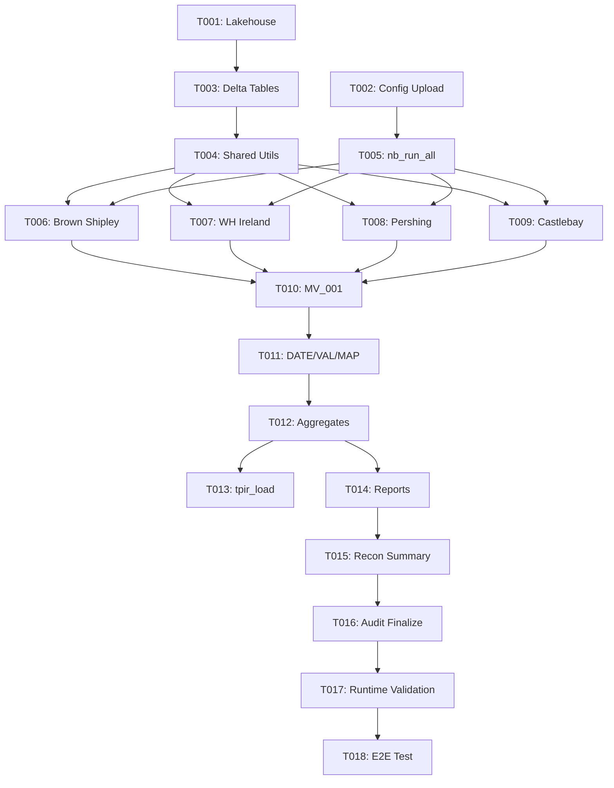

# Tasks: DFM PoC — Ingestion Pipeline

**Feature**: `001-dfm-poc-ingestion`  
**Owner**: `app-python`  
**Platform**: Microsoft Fabric — PySpark notebooks, Delta Lake, OneLake

---

## Implementation Strategy

This feature is organized by user story to enable independent implementation and testing:

- **Phase 1**: Setup (project initialization)
- **Phase 2**: Foundational (blocking prerequisites for all user stories)
- **Phase 3**: User Story 1 (P1) — Period Ingestion
- **Phase 4**: User Story 2 (P2) — Validation Results
- **Phase 5**: User Story 3 (P3) — Reconciliation Reports
- **Phase 6**: User Story 4 (P4) — Audit & Reconciliation Summary
- **Phase 7**: Polish & Cross-Cutting Concerns

---

## Phase 1: Setup (Project Initialization)

- [ ] T001 Create Fabric Lakehouse and enable Delta Lake in notebooks/dfm_poc_ingestion/nb_setup
- [ ] T002 Upload config files to /Files/config/: dfm_registry.json, raw_parsing_config.json, rules_config.json, currency_mapping.json, fx_rates.csv

---

## Phase 2: Foundational (Blocking Prerequisites)

- [ ] T003 Create all seven Delta tables in notebooks/dfm_poc_ingestion/nb_setup with schemas from data-model.md
- [ ] T004 [P] Create shared Python utility library in notebooks/dfm_poc_ingestion/shared_utils.py with parse_numeric, parse_date, apply_fx, row_hash (SHA-256), emit_audit, emit_parse_error, emit_drift_event, emit_validation_event
- [ ] T005 Implement nb_run_all entrypoint notebook in notebooks/dfm_poc_ingestion/nb_run_all with period parameter, run_id generation, DFM invocation loop, try/except fault isolation per 03_run_orchestration.md

---

## Phase 3: User Story 1 (P1) — Run Period Ingestion for All DFMs

**Goal**: Populate canonical_holdings from all four DFM sources with idempotent MERGE upsert.

**Independent Test**: Place sample files in landing zone, run nb_run_all, query canonical_holdings and run_audit_log.

### T006-T009: DFM Ingestion Notebooks

- [ ] T006 [P] [US1] Implement Brown Shipley ingestion in notebooks/dfm_poc_ingestion/nb_ingest_brown_shipley parsing Notification.csv + Cash CSV per 10_dfm_brown_shipley.md with European decimal handling
- [ ] T007 [P] [US1] Implement WH Ireland ingestion in notebooks/dfm_poc_ingestion/nb_ingest_wh_ireland parsing Standard Life XLSX per 11_dfm_wh_ireland.md with GBP priority rules
- [ ] T008 [P] [US1] Implement Pershing ingestion in notebooks/dfm_poc_ingestion/nb_ingest_pershing parsing Positions.csv + Valuation XLSX per 12_dfm_pershing.md with row-hash dedup and backfill logic
- [ ] T009 [P] [US1] Implement Castlebay ingestion in notebooks/dfm_poc_ingestion/nb_ingest_castlebay parsing multi-sheet XLSX per 13_dfm_castlebay.md with filename date inference and currency mapping

---

## Phase 4: User Story 2 (P2) — View Validation Results per DFM

**Goal**: Populate validation_events with MV_001, DATE_001, VAL_001, MAP_001 results.

**Independent Test**: Query validation_events after canonical_holdings is populated.

- [ ] T010 [US2] Implement MV_001 market value recalculation in notebooks/dfm_poc_ingestion/nb_validate per 05_validations.md with tolerance checks from rules_config.json
- [ ] T011 [US2] Implement DATE_001, VAL_001, MAP_001 validation rules in notebooks/dfm_poc_ingestion/nb_validate per 05_validations.md with not_evaluable emission for missing fields

---

## Phase 5: User Story 3 (P3) — Download Reconciliation Reports

**Goal**: Write Report 1 per DFM, Report 2 roll-up, and reconciliation_summary.json to output folder.

**Independent Test**: Run nb_reports after validation completes; check output folder for CSVs and JSON.

- [ ] T012 [US3] Implement policy_aggregates computation in notebooks/dfm_poc_ingestion/nb_aggregate grouping canonical_holdings by (period, run_id, dfm_id, policy_id)
- [ ] T013 [P] [US3] Implement tpir_load_equivalent projection in notebooks/dfm_poc_ingestion/nb_aggregate mapping to 13-column schema per 02_data_contracts.md
- [ ] T014 [US3] Implement Report 1 and Report 2 generation in notebooks/dfm_poc_ingestion/nb_reports per 06_outputs_and_reports.md writing four report1_<dfm_id>.csv and one report2_rollup.csv

---

## Phase 6: User Story 4 (P4) — Inspect Run Audit Log and Reconciliation Summary

**Goal**: Finalize run_audit_log and write reconciliation_summary.json with DFM-level totals.

**Independent Test**: Query run_audit_log and read reconciliation_summary.json after complete run.

- [ ] T015 [US4] Implement reconciliation_summary.json generation in notebooks/dfm_poc_ingestion/nb_reports sourcing totals from policy_aggregates per 07_audit_and_recon.md
- [ ] T016 [US4] Update run_audit_log in notebooks/dfm_poc_ingestion/nb_run_all with completed_at timestamp and final status per DFM

---

## Phase 7: Polish & Cross-Cutting Concerns

- [ ] T017 Add runtime validation to nb_run_all: measure elapsed time and assert ≤30 minutes per plan.md Performance Goals
- [ ] T018 Execute end-to-end acceptance test per quickstart.md validating all 5 success criteria (SC-001 through SC-005)

---

## Dependencies

---

## Parallel Execution Opportunities

- **Phase 2**: T004 (shared utils) can run in parallel with T003 (Delta table creation)
- **Phase 3**: T006, T007, T008, T009 (all four DFM ingestion notebooks) can be developed in parallel after T004 completes
- **Phase 5**: T013 (tpir_load) can run in parallel with T012 (policy_aggregates) — both read from canonical_holdings

---

## Task Details

### Phase 1: Setup

#### T001: Create Fabric Lakehouse

owner: app-python

Create a new Fabric Lakehouse workspace and enable Delta Lake support. Create the `nb_setup` notebook.

acceptance:
- Lakehouse is accessible via PySpark notebooks
- `nb_setup` notebook exists and can execute DDL statements

validate:
- Open Fabric workspace and confirm Lakehouse appears in resource list
- Run a test PySpark query against the Lakehouse and confirm it executes without error

---

#### T002: Upload config files

owner: app-python

Upload all five config files to `/Files/config/` in OneLake: `dfm_registry.json`, `raw_parsing_config.json`, `rules_config.json`, `currency_mapping.json`, `fx_rates.csv`.

acceptance:
- All five config files present under `/Files/config/`
- JSON files parse without syntax errors
- CSV file loads as a Spark DataFrame without error

validate:
- List files at `/Files/config/` and confirm all five are present
- Load each config file in a scratch notebook and confirm no parsing exceptions

---

### Phase 2: Foundational

#### T003: Create all seven Delta tables

owner: app-python

Run DDL statements in `nb_setup` to create: `canonical_holdings`, `tpir_load_equivalent`, `policy_aggregates`, `validation_events`, `run_audit_log`, `schema_drift_events`, `parse_errors` with schemas from `data-model.md`.

acceptance:
- All seven Delta tables exist with schemas matching `data-model.md`
- `canonical_holdings` is partitioned by `period` and `dfm_id`
- Schemas are consistent with authoritative product schema in `specs/000-dfm-poc-product/data-model.md`

validate:
- Run `spark.catalog.listTables()` and confirm all seven table names present
- Run `DESCRIBE TABLE canonical_holdings` and verify partitioning columns

---

#### T004: Create shared Python utility library

owner: app-python

Create `shared_utils.py` with eight functions: `parse_numeric(value, european=False)`, `parse_date(value)`, `apply_fx(local_value, local_currency, fx_rates)`, `row_hash(fields)` (deterministic SHA-256), `emit_audit(...)`, `emit_parse_error(...)`, `emit_drift_event(...)`, `emit_validation_event(...)`.

acceptance:
- All eight functions importable from all DFM notebooks
- `parse_numeric` correctly handles UK/US (`3,479.29`) and European (`3.479,29`) formats per config flag
- `row_hash` produces deterministic SHA-256 hash from input fields (fixes FR-007 ambiguity)

validate:
- Import library in scratch notebook; confirm `parse_numeric("3.479,29", european=True)` returns `3479.29`
- Confirm `parse_numeric("3,479.29", european=False)` returns `3479.29`
- Confirm `row_hash(["field1", "field2"])` produces consistent 64-character hex string across multiple invocations

---

#### T005: Implement nb_run_all entrypoint

owner: app-python

Create `nb_run_all` orchestration notebook with `period` parameter (YYYY-MM). Generate `run_id` as UTC timestamp. Loop over enabled DFMs from `dfm_registry.json`; invoke each DFM notebook with try/except isolation. Emit one `run_audit_log` row per DFM regardless of outcome (OK/NO_FILES/PARTIAL/FAILED). Implements contract from `03_run_orchestration.md`.

acceptance:
- Notebook accepts `period` parameter and generates `run_id`
- DFM invocation loop continues when one DFM notebook fails
- `run_audit_log` receives one row per DFM per run with status field populated

validate:
- Run `nb_run_all` with empty landing zone; verify four `run_audit_log` rows with `status=NO_FILES`
- Introduce deliberate failure in one DFM; confirm other three complete and audit shows one `FAILED`, three `OK`
- Run `nb_run_all` twice for same period; confirm `COUNT(*) FROM canonical_holdings WHERE period=<period>` unchanged (idempotency via SHA-256 row_hash MERGE)

---

### Phase 3: User Story 1 (P1)

#### T006: Implement Brown Shipley ingestion

owner: app-python

Parse `Notification.csv` (positions) + `Notification - Cash.csv` (cash) from landing zone per `10_dfm_brown_shipley.md`. Apply header-row detection, European decimal parsing (`parse_numeric(..., european=True)`), GBP assumption with `CURRENCY_ASSUMED_GBP` flag. Write to `canonical_holdings` with `dfm_id=brown_shipley`. Emit parse errors and schema drift events.

acceptance:
- Both CSV files parsed and written to `canonical_holdings` with `dfm_id=brown_shipley`
- European decimals (e.g., `3.479,29`) correctly parsed as numeric values
- Rows with absent currency flagged with `data_quality_flags` containing `CURRENCY_ASSUMED_GBP`

validate:
- Count rows where `dfm_id='brown_shipley'` — must be > 0
- Spot-check a row with European decimal source; confirm numeric value correct
- Confirm `data_quality_flags` array non-empty for rows with assumed GBP

---

#### T007: Implement WH Ireland ingestion

owner: app-python

Parse Standard Life Valuation Data XLSX per `11_dfm_wh_ireland.md`. Apply GBP rules: use `Settled Market Value (PC)` when currency is GBP; use ABC column when base currency is GBP; else FX table; else null + `FX_NOT_AVAILABLE` flag. Set cash and accrued to 0 with `CASH_DEFAULTED`/`ACCRUED_DEFAULTED` flags. Write to `canonical_holdings` with `dfm_id=wh_ireland`.

acceptance:
- WH Ireland XLSX parsed and written with `dfm_id=wh_ireland`
- `bid_value_gbp` populated for GBP-denominated positions
- Non-GBP rows without FX have `bid_value_gbp=null` and `FX_NOT_AVAILABLE` flag

validate:
- Count rows where `dfm_id='wh_ireland'` — must be > 0
- For GBP rows confirm `bid_value_gbp=bid_value_local`
- Confirm non-GBP rows without FX have null `bid_value_gbp` or computed value from ABC column

---

#### T008: Implement Pershing ingestion

owner: app-python

Parse `Positions.csv` (primary) + PSL valuation holdings CSV (secondary) per `12_dfm_pershing.md`. Apply SHA-256 row-hash de-duplication; prefer `Positions.csv` rows; backfill missing policies/values from valuation holdings. Apply GBP rules. Write to `canonical_holdings` with `dfm_id=pershing`.

acceptance:
- Both files ingested; `canonical_holdings` contains rows with `dfm_id=pershing`
- SHA-256 row-hash de-duplication prevents double-counting when duplicate files placed in landing zone
- `Positions.csv` rows take precedence over valuation holdings for same position

validate:
- Place duplicate file copy in landing zone; confirm row count does not double
- Confirm rows sourced from `Positions.csv` present and correctly mapped
- Confirm backfill logic applies only for policies absent from `Positions.csv`

---

#### T009: Implement Castlebay ingestion

owner: app-python

Parse `Cde OSB Val 31Dec25.xlsx` per `13_dfm_castlebay.md` — both `Customer 1` and `Customer 2` sheets. Header row is row 3. Infer `report_date` from filename (`31Dec25` → `2025-12-31`) and set `DATE_FROM_FILENAME` flag. Map currency via `currency_mapping.json`. Set cash and accrued to 0 with flags. Write to `canonical_holdings` with `dfm_id=castlebay`.

acceptance:
- Both sheets parsed and written with `dfm_id=castlebay`
- `report_date` correctly inferred from filename and `DATE_FROM_FILENAME` flag set
- Currency ISO codes derived from `Currency Description` column via `currency_mapping.json`

validate:
- Count rows where `dfm_id='castlebay'` — must be > 0 from both sheets
- Confirm `report_date=2025-12-31` for all Castlebay rows
- Spot-check row with "Pound Sterling" → `GBP` mapping

---

### Phase 4: User Story 2 (P2)

#### T010: Implement MV_001 market value recalculation

owner: app-python

Implement `MV_001` in `nb_validate` per `05_validations.md`. For rows where `holding`, `local_bid_price`, `bid_value_gbp` all non-null, compute `holding × local_bid_price × fx_rate` and compare to `bid_value_gbp`. Emit `fail` event when absolute diff exceeds `tolerance_abs_gbp` or percentage diff exceeds `tolerance_pct` from `rules_config.json`. Emit `not_evaluable` when required fields absent.

acceptance:
- MV_001 evaluable and producing results for WH Ireland, Pershing, Castlebay rows
- `not_evaluable` status emitted for rows missing `holding`, `local_bid_price`, or `bid_value_gbp`
- `fail` events written to `validation_events` with `details_json` containing `computed_mv`, `reported_mv`, `abs_diff`, `pct_diff`

validate:
- Confirm at least one MV_001 event exists in `validation_events` after run
- Introduce row with known MV discrepancy > tolerance; confirm `fail` event generated
- Confirm `not_evaluable` events for Brown Shipley rows missing price data

---

#### T011: Implement DATE_001, VAL_001, MAP_001 rules

owner: app-python

Implement remaining validation rules in `nb_validate` per `05_validations.md`: `DATE_001` (stale report date, weekend-only calendar), `VAL_001` (no cash and no stock at policy level), `MAP_001` (unmapped securities / residual cash proxy). Write events to `validation_events` with correct `severity` and `status` per `rules_config.json`.

acceptance:
- `DATE_001` fires `warning` when `report_date` > 5 working days after month-end; `not_evaluable` when `report_date` null
- `VAL_001` fires `exception` for policies with both `total_cash_value_gbp=0` and `total_bid_value_gbp=0`
- `MAP_001` classifies rows with null `security_id` as residual cash if `bid_value_gbp<1000`, else `exception`

validate:
- Introduce row with `report_date` 10 days after month-end; confirm `DATE_001` event with `status=warning`
- Introduce row with `report_date=null`; confirm `DATE_001` event with `status=not_evaluable`
- Confirm at least one `VAL_001` and `MAP_001` event in `validation_events` after run

---

### Phase 5: User Story 3 (P3)

#### T012: Compute policy_aggregates

owner: app-python

Group `canonical_holdings` by `(period, run_id, dfm_id, policy_id)` in `nb_aggregate`. Compute `total_cash_value_gbp`, `total_bid_value_gbp`, `total_accrued_interest_gbp`. Write to `policy_aggregates` Delta table.

acceptance:
- `policy_aggregates` contains one row per distinct `(period, run_id, dfm_id, policy_id)` combination
- Aggregate totals match sum of corresponding rows in `canonical_holdings`
- All four DFMs represented after complete run

validate:
- Count distinct `(dfm_id, policy_id)` in `policy_aggregates`; confirm matches manual grouping
- Spot-check one policy's `total_bid_value_gbp` against sum in `canonical_holdings`

---

#### T013: Produce tpir_load_equivalent

owner: app-python

Select and rename columns from `canonical_holdings` in `nb_aggregate` to match 13-column tpir_load schema from `02_data_contracts.md`. Write to `tpir_load_equivalent` Delta table.

acceptance:
- `tpir_load_equivalent` contains all 13 required columns: `Policyholder_Number`, `Security_Code`, `ISIN`, `Other_Security_ID`, `ID_Type`, `Asset_Name`, `Acq_Cost_in_GBP`, `Cash_Value_in_GBP`, `Bid_Value_in_GBP`, `Accrued_Interest`, `Holding`, `Loc_Bid_Price`, `Currency_Local`
- Row count matches `canonical_holdings`

validate:
- Run `spark.read.table("tpir_load_equivalent").columns` and confirm all 13 columns present
- Confirm row count equals `canonical_holdings` row count

---

#### T014: Write Report 1 and Report 2

owner: app-python

Generate reports in `nb_reports` per `06_outputs_and_reports.md`. Write Report 1 CSV per DFM to `/Files/output/period=YYYY-MM/run_id=<run_id>/report1_<dfm_id>.csv` with validation failures grouped by policy and rule. Write Report 2 roll-up CSV with counts by DFM, rule, severity.

acceptance:
- Four Report 1 CSVs written (one per DFM) after complete run
- One Report 2 CSV written per run
- Report 1 includes columns: `dfm_id`, `policy_id`, `rule_id`, `severity`, `status`, `count`
- Report 2 includes columns: `dfm_id`, `rule_id`, `severity`, `count`

validate:
- Confirm four Report 1 files and one Report 2 file exist in output folder
- Open Report 1 CSV and verify expected columns and at least one data row

---

### Phase 6: User Story 4 (P4)

#### T015: Write reconciliation_summary.json

owner: app-python

Compute reconciliation summary in `nb_reports` per `07_audit_and_recon.md`. Source DFM-level totals (cash/bid/accrued) from `policy_aggregates`; include row counts by DFM. Write JSON to `/Files/output/period=YYYY-MM/run_id=<run_id>/reconciliation_summary.json`.

acceptance:
- `reconciliation_summary.json` written to run output folder with totals for all four DFMs
- JSON contains `dfm_summary` array with entries for each `dfm_id` including `canonical_row_count`, `total_cash_value_gbp`, `total_bid_value_gbp`, `total_accrued_interest_gbp`

validate:
- Read `reconciliation_summary.json` and confirm entries for all four DFM IDs
- Compare totals in JSON against query results from `policy_aggregates`

---

#### T016: Update run_audit_log with final status

owner: app-python

Update `run_audit_log` in `nb_run_all` post-loop with `completed_at` timestamp and final `status` per DFM. Include `files_processed`, `rows_ingested`, `parse_errors_count`, `drift_events_count` fields per `07_audit_and_recon.md`.

acceptance:
- `run_audit_log` contains one row per DFM per run with all required audit fields
- `status` reflects `OK`, `NO_FILES`, `PARTIAL`, or `FAILED` correctly
- `completed_at` timestamp non-null for all four DFMs

validate:
- Query `run_audit_log` for current `run_id`; confirm four rows present
- Confirm `completed_at` non-null and `status` values valid

---

### Phase 7: Polish & Cross-Cutting

#### T017: Add runtime validation

owner: app-python

Measure elapsed time in `nb_run_all` from start to completion. Assert total duration ≤30 minutes per plan.md Performance Goals. Emit warning to audit log if threshold exceeded.

acceptance:
- `nb_run_all` records `started_at` and `completed_at` timestamps
- Elapsed duration computed and logged
- Test run completes within 30 minutes on Fabric shared compute

validate:
- Run `nb_run_all` with sample data for all four DFMs
- Confirm audit log shows elapsed time and value is ≤30 minutes

---

#### T018: Execute end-to-end acceptance test

owner: app-python

Run full pipeline exercise per `quickstart.md`. Validate all 5 success criteria from spec.md: SC-001 (all DFMs in canonical_holdings), SC-002 (MV_001 events for WH Ireland/Pershing/Castlebay), SC-003 (Report 1+2 files exist), SC-004 (run_audit_log completeness), SC-005 (idempotent re-runs).

acceptance:
- All success criteria SC-001 through SC-005 verified
- End-to-end checklist from `quickstart.md` completed without failures
- Evidence documented for each criterion

validate:
- Execute checklist step-by-step
- Confirm each SC-* item passes; document any gaps as follow-up issues

---

## Phase 8: Reference Data, Downstream Load & Quality Gate

### Overview

Phase 8 closes the gaps between the automated PoC pipeline and the full end-to-end operational process: security master enrichment, policy mapping validation, TPIR quality gate, and ADS load. These tasks depend on Phase 5 (tpir_load_equivalent) being complete.

- [ ] T019 Upload security_master.csv to /Files/config/ with schema from 14_config_inputs.md and verify enrichment join works against sample data
- [ ] T020 Implement security master enrichment join in nb_ingest shared utils: before writing to canonical_holdings, attempt ISIN/SEDOL join against security_master.csv to populate security_id and asset_name
- [ ] T021 Enable and implement POP_001 in nb_validate per updated 05_validations.md: load policy_mapping.csv, join to canonical_holdings on (dfm_id, policy_id), emit fail for unmapped rows, warning for REMOVE-status rows, not_evaluable when file absent
- [ ] T022 Implement nb_tpir_check per 15_tpir_upload_checker.md: run TC-001 through TC-007, write tpir_check_result.json to run output folder, update run_audit_log
- [ ] T023 Implement nb_ads_load per 16_ads_loading.md: gate on tpir_check_result.json status=passed, batch POST to ADS REST API, poll for committed status, update run_audit_log with ads_load_status, ads_load_rows, ads_load_completed_at
- [ ] T024 Execute extended end-to-end acceptance test: confirm TPIR check passes, ADS load commits, run_audit_log shows ads_load_status=committed; re-run same period and confirm idempotency at ADS (no duplicate rows)

---

### Task Details

#### T019: Upload security_master.csv

owner: app-python

Upload a populated `security_master.csv` to `/Files/config/` covering all securities appearing in the PoC sample data for all four DFMs. Schema per `14_config_inputs.md`: `isin`, `sedol`, `asset_name`, `asset_class`, `currency_iso`.

acceptance:
- `security_master.csv` present under `/Files/config/` with correct column headers
- File loads as a Spark DataFrame without schema errors
- Covers all ISINs and SEDOLs in the PoC sample dataset (zero MAP_001 exceptions for known securities)

validate:
- Load file in a scratch notebook and run `df.schema` — confirm five columns match spec
- Run full pipeline with sample data; confirm `MAP_001` exception count drops to zero for securities that were previously unmapped

---

#### T020: Implement security master enrichment join

owner: app-python

Add an enrichment step to `shared_utils.py` (`enrich_security_id`) and call it from each DFM ingestion notebook after canonical mapping but before writing to `canonical_holdings`. The join attempts: (1) ISIN match on `security_master.csv`.`isin`, then (2) SEDOL match on `security_master.csv`.`sedol`. On match, populate `security_id` (ISIN) and `asset_name` if currently null.

acceptance:
- Rows with null `security_id` but a matching ISIN/SEDOL in `security_master.csv` are enriched before writing to `canonical_holdings`
- `asset_name` is populated from `security_master.csv` when absent from the DFM source
- Rows with no match in `security_master.csv` remain with null `security_id` and trigger `MAP_001` as before

validate:
- Place a row with ISIN null but SEDOL matching a `security_master.csv` entry; confirm `security_id` is populated in `canonical_holdings`
- Place a row with no ISIN and no matching SEDOL; confirm `security_id` remains null and `MAP_001` fires
- Confirm all four DFM notebooks call the enrichment function

---

#### T021: Enable and implement POP_001

owner: app-python

Implement `POP_001` in `nb_validate` per the updated `05_validations.md`. Load `policy_mapping.csv` from `/Files/config/`. Left join `canonical_holdings` on `(dfm_id, policy_id)`. Emit `fail` for rows with no match, `warning` for rows matching a `status=REMOVE` entry, `not_evaluable` for all rows when file is absent. Enable by default in `rules_config.json`.

acceptance:
- `POP_001` emits `fail` events for any `(dfm_id, policy_id)` absent from `policy_mapping.csv`
- `POP_001` emits `warning` events for `status=REMOVE` mapped policies
- `POP_001` emits `not_evaluable` for all rows when `policy_mapping.csv` absent
- `rules_config.json` has `POP_001` enabled by default

validate:
- Add a row with a policy absent from `policy_mapping.csv`; confirm `POP_001` `fail` event in `validation_events`
- Add a row with `status=REMOVE` policy; confirm `warning` event
- Remove `policy_mapping.csv` from config; confirm `not_evaluable` status for all rows
- Confirm `POP_001` result does not prevent pipeline from completing

---

#### T022: Implement nb_tpir_check

owner: app-python

Create `nb_tpir_check` per `15_tpir_upload_checker.md`. Read `tpir_load_equivalent` filtered to current `run_id`. Evaluate TC-001 through TC-007 per `rules_config.json`. Write `tpir_check_result.json` to `/Files/output/period=YYYY-MM/run_id=<run_id>/`. Update `run_audit_log` with TPIR check outcome.

acceptance:
- `tpir_check_result.json` written after each run with `status: passed` or `status: failed`
- Blocking failures (TC-001 through TC-005) set `status: failed` and populate `blocking_failures` array
- Warnings (TC-006, TC-007) do not set `status: failed`
- `run_audit_log` updated with TPIR check status

validate:
- Run with valid `tpir_load_equivalent`; confirm `tpir_check_result.json` shows `status: passed`
- Introduce a row with null `Policyholder_Number`; confirm TC-003 fires and `status: failed`
- Introduce a row with invalid `Currency_Local` (`XYZ`); confirm TC-005 fires and `status: failed`
- Confirm warnings (TC-007) do not flip `status` to `failed`

---

#### T023: Implement nb_ads_load

owner: app-python

Create `nb_ads_load` per `16_ads_loading.md`. Gate on `tpir_check_result.json` `status=passed`. Batch `tpir_load_equivalent` rows into `POST /api/v1/tpir/load` requests using `batch_size` from `ads_config.json`. Poll `GET /api/v1/tpir/load/{runId}` for `committed` status. Update `run_audit_log` with `ads_load_status`, `ads_load_rows`, `ads_load_completed_at`.

acceptance:
- `nb_ads_load` refuses to run when `tpir_check_result.json` is absent or `status: failed`
- All `tpir_load_equivalent` rows for `run_id` are submitted to ADS
- `run_audit_log` shows `ads_load_status=committed` and correct `ads_load_rows` count after successful load
- Re-submitting the same `run_id` to ADS is a no-op (idempotency confirmed via ADS response)

validate:
- Run full pipeline to committed ADS load; confirm `ads_load_status=committed` in `run_audit_log`
- Run with failed TPIR check; confirm `ads_load_status=skipped_tpir_check_failed` and no ADS API call made
- Simulate ADS 5xx error; confirm retry logic activates and eventually sets `ads_load_status=failed`
- Re-run same period; confirm ADS returns idempotent response and `ads_load_rows` matches original

---

#### T024: Extended end-to-end acceptance test

owner: app-python

Extend T018 to cover the full pipeline including TPIR check, ADS load, and idempotency. Validate the six additional outcomes: TPIR check pass, ADS committed, run_audit_log completeness (with ADS fields), idempotent ADS re-run, MAP_001 resolution workflow, POP_001 resolution workflow.

acceptance:
- SC-001 through SC-005 from T018 still pass
- `tpir_check_result.json` shows `status: passed` at end of successful run
- `run_audit_log` shows `ads_load_status=committed` and non-zero `ads_load_rows`
- Re-running same period does not duplicate ADS data
- Adding a new entry to `security_master.csv` and re-running resolves a MAP_001 exception
- Adding a new entry to `policy_mapping.csv` and re-running resolves a POP_001 exception

validate:
- Execute full run with clean sample data; confirm all six outcomes above
- Document evidence for each outcome as follow-up issue or test log entry
